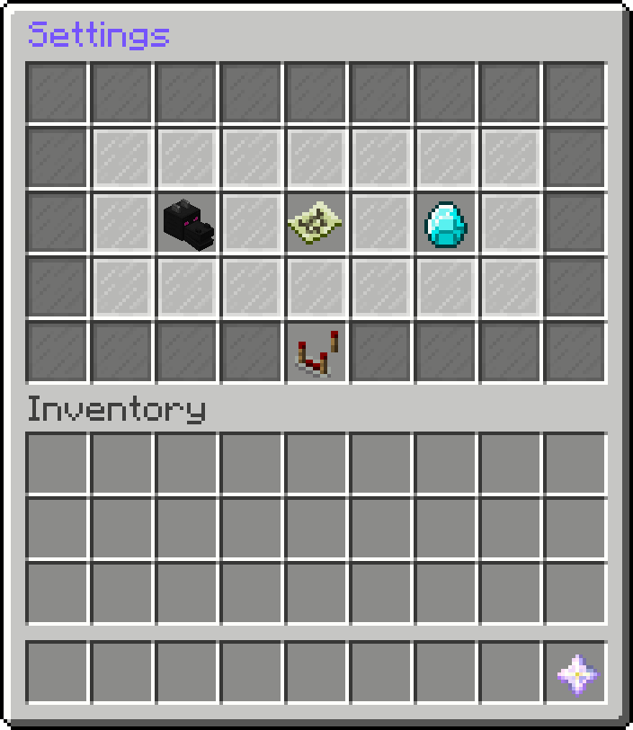
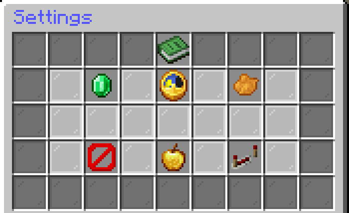
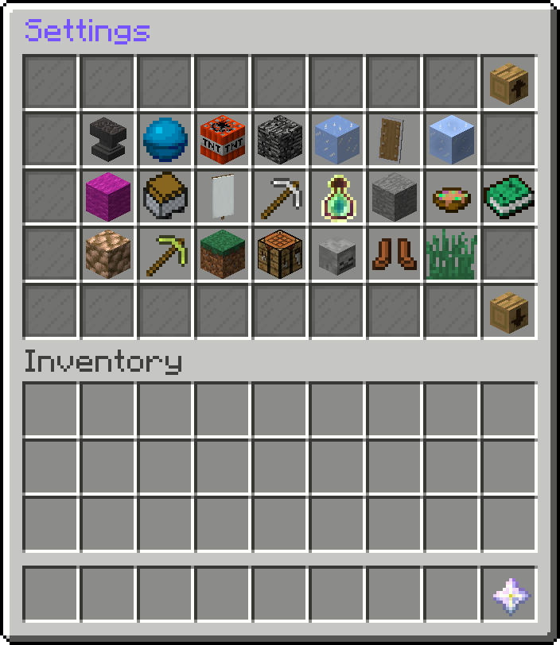
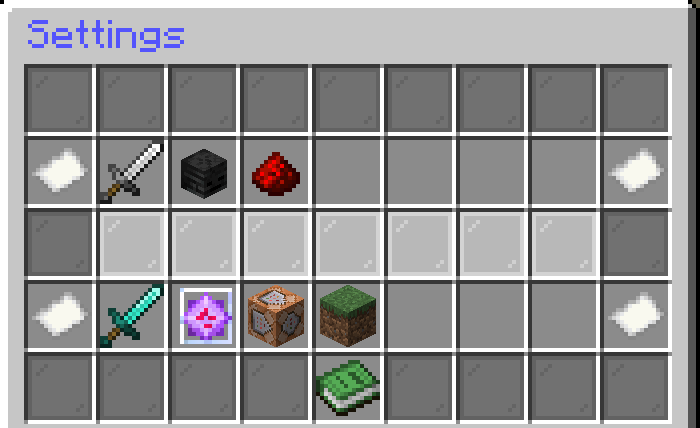
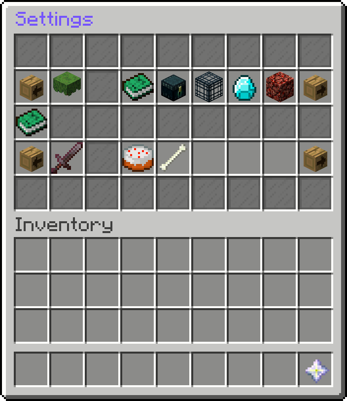

# Features

StckUtils is a challenge plugin inspired by DerBanko's BUtils. It works in a similar way:
StckUtils has a Timer, Challenges, GameChanges and Goals.

If you have ideas for new features or ideas on how to improve something, you can reach us by creating an issue or
contacting us on Discord ([StckOverflw](https://discordapp.com/users/816989010836717599), [l4zs](https://discordapp.com/users/275995368733278218))

- [General](#general)
- [Timer](#timer)
- [Challenges](#challenges)
- [GameChanges](#gamechanges)
- [Goals](#goals)
- [Other Features](#other-features)
- [Permissions](#permissions)

## General

If you are unable to find some features, please check if you gave yourself the required [permissions](#permissions) for
the specific feature. If you're still unable to find it, you can reach us by creating an issue or contacting us on
Discord ([StckOverflw](https://discordapp.com/users/816989010836717599), [l4zs](https://discordapp.com/users/275995368733278218))

 

Everything is configurable through a gui you can open with
`/settings` or by right-clicking with the nether star you'll have in your inventory when the Timer is paused.

The settings gui looks like this:

## Timer

The Timer is used to keep track of your play time needed for reaching a goal or failing to a challenge.

The Timer gui looks like this:

    
Here you can..

    <ul>
        <li>start and stop the Timer</li>
        <li>reset the Timer</li>
        <li>change the time</li>
        <li>set who should be able to join while the Timer is running</li>
        <li>change the Timer's color</li>
        <li>set the Direction the Timer should count in (forwards or backwards)</li>
    </ul>

You can also use the Timer command to start, stop and reset the Timer easily (`/timer <resume|stop|reset>`).

## Challenges

Challenges make it easier or harder to play the game and reach the goal.

The Challenge gui looks like this:

Here you can activate (left-click) and configure (right-click on activated challenge) the challenge (you can activate
multiple at once)

    
Heres a list of all challenges included (as of v1.3.2)..

    <ul>
       <li>AdvancementDamage</li>
       <li>BalanceLife</li>
       <li>BlockExplode</li>
       <li>ChunkFlattener</li>
       <li>DamageFreeze</li>
       <li>DamageSwap</li>
       <li>GamerChallenge</li>
       <li>IceWalker</li>
       <li>InventoryDamageClear</li>
       <li>InventorySwap</li>
       <li>InvisibleEntities</li>
       <li>JackHammer</li>
       <li>LevelBorder</li>
       <li>Medusa</li>
       <li>MobDuplicator</li>
       <li>MobMagnet</li>
       <li>NoBlockBreak</li>
       <li>NoBlockPlace</li>
       <li>NoCrafting</li>
       <li>NoDeath</li>
       <li>NoFallDamage</li>
       <li>NoSneak</li>
       <li>NoVillagerTrade</li>
       <li>NoXP</li>
       <li>RandomEffect</li>
       <li>RandomItem</li>
       <li>Randomizer</li>
       <li>SingleUse</li>
       <li>Snake</li>
    </ul>

## GameChanges

GameChanges add non-game-changig features to the game or let you configure basic minecraft features (like gamerules) in
an easy way.

The GameChange gui looks like this:

Here you can configure the gamechanges.

    
Heres a list of all gamechanges included (as of v1.3.2)..

    <ul>
       <li>AllowPvP</li>
       <li>DamageMultiplier</li>
       <li>DeathCounter</li>
       <li>Difficulty</li>
       <li>KeepInventory</li>
       <li>MaxHealth</li>
       <li>SpawnWorld</li>
    </ul>

## Goals

Goals set the goal you have to reach to win the game.

The Goal gui looks like this:

Here you can activate (left-click) and configure (right-click on activated challege) one (yeah, just one) goal, either a
TeamGoal (coop, all win when reached) or a Battle (pvp, first to reach wins).

    
Heres a list of all goals included (as of v1.3.2)..

    <ul>
       <li>AllAdvancements</li>
       <li>AllItems</li>
       <li>AllMobs</li>
       <li>BakeCake</li>
       <li>FindDiamond</li>
       <li>GoToNether</li>
       <li>KillEnderdragon</li>
       <li>Survive</li>
    </ul>

## Other Features

- Hide players with the hide command (`/hide <player>`)
- Create (and show saved) positions to remove the hassle of remembering coordinates (`/position <name>`)

## Permissions

`/allx` - no permission

---

`/hide` - stckutils.command.hide
- Hide yourself - stckutils.function.hide.self
- Hide other Players - stckutils.function.hide.other

---

`/position` - stckutils.command.position
- Create a position - stckutils.function.position.create
- Show an already created position: stckutils.function.position.show

---

`/settings` - stckutils.command.settings
- Being able to open the settings gui - stckutils.function.settings.gui
- Get the Settings Item while the Timer is paused - stckutils.function.settings.item

---

`/timer` - stckutils.command.timer
- Reset the Timer - stckutils.function.timer.reset
- Start the Timer - stckutils.function.timer.start
- Stop the Timer - stckutils.function.timer.stop
